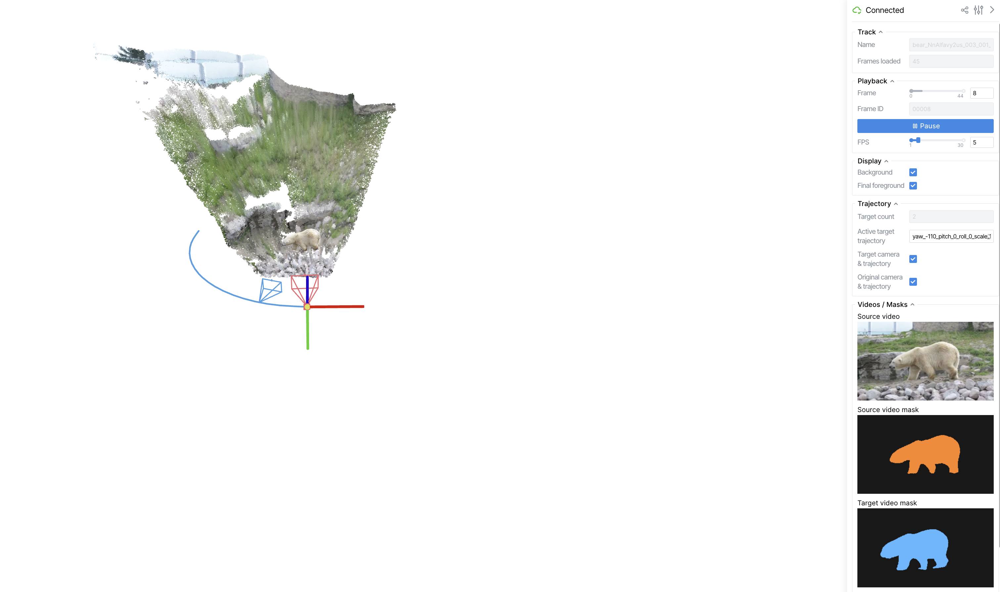
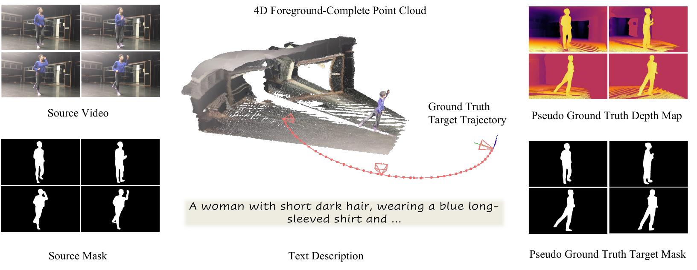
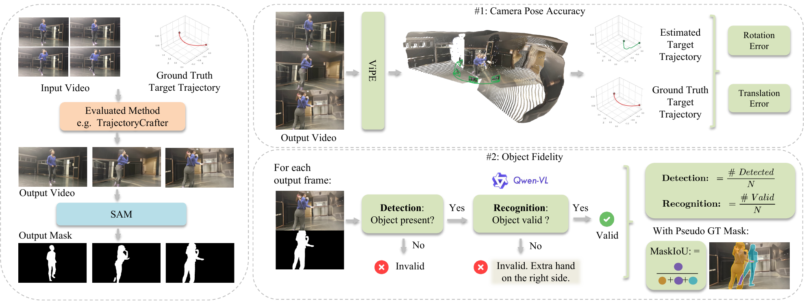
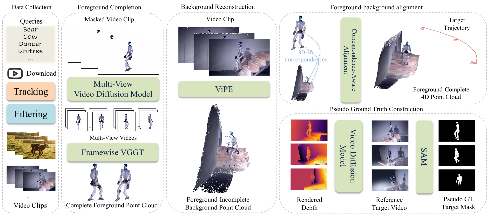

<p align="center">
  
</p>

<p align="center">
  <strong>A Dataset and Benchmark for Camera Redirection of Monocular Dynamic Videos with Pseudo-4D References</strong>
</p>

<p align="center">
  <a href="https://vveicao.github.io/">Wei Cao</a><sup>1</sup> ·
  <a href="https://haoz19.github.io/">Hao Zhang</a><sup>1</sup> ·
  <a href="https://tangjiapeng.github.io/">Jiapeng Tang</a><sup>2</sup> ·
  <a href="https://yulunwu0108.github.io/">Yulun Wu</a><sup>1</sup> ·
  <a href="https://www.yingying.li/">Yingying Li</a><sup>1</sup> ·
  <a href="https://ningyu1991.github.io/">Ning Yu</a><sup>3</sup> ·
  <a href="https://shenlong.web.illinois.edu/">Shenlong Wang</a><sup>1</sup> ·
  <a href="https://yaoyaoliu.web.illinois.edu/">Yaoyao Liu</a><sup>1</sup>
</p>

<p align="center">
  <sup>1</sup>University of Illinois Urbana-Champaign &nbsp;·&nbsp;
  <sup>2</sup>Technical University of Munich &nbsp;·&nbsp;
  <sup>3</sup>Netflix
</p>

<p align="center">
  <a href="https://vveicao.github.io/projects/redirect4d-bench/"></a>
  <a href="#"></a>
  <a href="https://huggingface.co/datasets/vveicao/redirect4d-bench"></a>
</p>

> **TL;DR:** Redirect4D-Bench is a dataset and benchmark for camera redirection of monocular dynamic videos, with per-clip pseudo-4D references that directly measure camera following and subject placement.

## Motivation

**Camera redirection** takes a monocular source video and replays the same dynamic event along a user-requested camera trajectory.

**High video-metric scores do not imply successful camera redirection.** Per-column CLIP/VBench winners scatter across baselines, yet none of those winning videos completes the task. Only FreeOrbit4D follows the requested trajectory while keeping the wolf intact, matching the human verdict.

<div align="center">
<table>
  <tr>
    <td align="center"><b>Source Video</b></td>
    <td align="center"><b>Interactive 4D</b><br><sub>(click to explore)</sub></td>
  </tr>
  <tr>
    <td align="center"></td>
    <td align="center"><a href="https://vveicao.github.io/projects/redirect4d-bench/web_assets/viewers/wolf.html"></a></td>
  </tr>
</table>
</div>

Each method is replayed along the same wolf trajectory. Per-column best in **red**.

<p align="center">
  
</p>

<sub><b>CLIP-T/F/V</b>: text, adjacent-frame, and source-video consistency. <b>VBench</b>: SC subject, BG background, TF temporal-flickering, MS motion-smoothness, AQ aesthetic, IQ imaging, OC overall consistency. The CLIP/VBench winners scatter across all four methods, while the human verdict points to the only one that completes the redirection.</sub>


> Full interactive showcase (4D viewer for every case, baseline gallery, per-case metric tables) on the [project page](https://vveicao.github.io/projects/redirect4d-bench/).

Redirect4D-Bench provides real dynamic-video cases with 4D point clouds, target trajectories, rendered target depth, and target pseudo-GT masks so that camera following and subject placement can be measured directly.

## Install

```bash
git clone --recursive https://github.com/VVeiCao/redirect4d-bench.git Redirect4D_Bench
cd Redirect4D_Bench

bash scripts/env/create_env.sh redirect4d-bench
conda activate redirect4d-bench
```

The base environment is enough for downloading data, validating folders, and
previewing the dataset. Evaluation and scale-up use two extra environments:

```bash
bash scripts/env/create_sam3_env.sh redirect4d-sam3
bash scripts/env/create_reconstruction_env.sh redirect4d-recon
bash scripts/env/check_all_envs.sh
```

For scale-up or reconstruction, also prepare the large reconstruction
checkpoints:

```bash
bash scripts/models/download_reconstruction_checkpoints.sh required
```

## Dataset Quick Review

Download the public sample, about 2 GB:

```bash
hf download vveicao/redirect4d-bench \
  --repo-type dataset \
  --include 'sample/**' \
  --local-dir data/redirect4d_bench
```

Open the Viser preview:

```bash
python scripts/visualization/serve_pointcloud_viser.py \
  --dataset-root data/redirect4d_bench/sample \
  --port 8091
```

Forward port `8091` and open it in your browser.

The viewer shows the animated foreground/background 4D point clouds, source
video if it exists in the selected dataset root, source mask, active target
trajectory, target mask, and target depth.



## Full Dataset

Download the public benchmark assets, about 54 GB:

```bash
hf download vveicao/redirect4d-bench \
  --repo-type dataset \
  --local-dir data/redirect4d_bench
```

The public full dataset does not include source RGB videos. The two sample
tracks include source RGB only for quick preview.

Public layout:

```text
data/redirect4d_bench/
  metadata.json
  tracks.jsonl
  cases.jsonl
  sample/
  tracks/<track>/
    camera.json
    masks/*.png
    mask_video.mp4
    pointcloud/
      global_background.ply
      <frame>/*.ply
      <frame>/*.npz
    redirected/<trajectory>/
      trajectory.json
      mask.mp4
      depth.mp4
      prompt.txt
```



File meanings:

- `metadata.json`, `tracks.jsonl`, `cases.jsonl`: case metadata, YouTube ids,
  crop boxes, frame ids, camera intrinsics, and trajectory names.
- `mask_video.mp4`, `masks/*.png`: source foreground masks.
- `pointcloud/`: released 4D point-cloud assets.
- `trajectory.json`: requested target camera path.
- `redirected/<trajectory>/depth.mp4`: rendered target-view pseudo-GT depth.
- `redirected/<trajectory>/mask.mp4`: refined target pseudo-GT mask.
- `prompt.txt`: frozen prompt used by the generation pipeline.

If you have access to the canonical source RGB package, install it with:

```bash
python scripts/data/install_restricted_sources.py \
  --source-dir /path/to/redirect4d_bench_restricted \
  --out data/reconstructed_source_tracks \
  --overwrite
```

The public metadata can also be used to recover source clips from original
videos:

```bash
python scripts/data/download_original_videos.py \
  --metadata data/redirect4d_bench/metadata.json \
  --output-dir data/original_videos

python scripts/data/reconstruct_source_tracks.py \
  --metadata data/redirect4d_bench/metadata.json \
  --video-dir data/original_videos \
  --output-root data/reconstructed_source_tracks
```

YouTube access depends on the user's network environment. If YouTube blocks the
download with bot/login verification, use the canonical source package instead.

Validate the local data:

```bash
python scripts/data/validate_dataset.py \
  --dataset-root data/redirect4d_bench \
  --restricted-source-root data/reconstructed_source_tracks
```

### Dataset Visualization

The Viser reads only the folder passed to `--dataset-root`.

```bash
python scripts/visualization/serve_pointcloud_viser.py \
  --dataset-root data/redirect4d_bench \
  --port 8091
```

For the public full dataset, the source-video panel stays empty because source
RGB is not included. If you pass a sample or local full-data folder that
contains `video.mp4`, the viewer displays source RGB as well.

## Evaluation

This public repo evaluates the Redirect4D-Bench object fidelity/localization
and camera-pose accuracy metrics. FID, FVD, CLIP, and VBench are not run here.



Generated videos should be named by case:

```text
<track>_<trajectory>.mp4
```

Use one folder per method:

```text
my_method/VIDEOS/
  bear_NnAlfavy2us_003_001_seq1_yaw_120_pitch_0_roll_0_scale_1.mp4
  elephant_4F0hzklQejU_010_001_seq1_yaw_-120_pitch_0_roll_0_scale_1.mp4
```

Evaluate that folder directly:

```bash
python scripts/evaluation/evaluate_user_method.py \
  --video-dir my_method/VIDEOS
```

By default this reads `data/redirect4d_bench`, evaluates every `.mp4` in
`my_method/VIDEOS`, and writes each run to:

```text
outputs/my_method/YYYYMMDD_HHMMSS/
```

Object fidelity expects only generated RGB videos from a submitted method. The
evaluation script extracts generated-video masks with the benchmark SAM3
propagation step, writes them next to the submitted videos, and compares them
to the dataset target pseudo-GT masks:

```text
my_method/mask/<track>_<trajectory>.mp4
```

Camera-pose accuracy reconstructs the camera path from each generated video
with the pinned reconstruction stack and compares it to the target trajectory.

## Scale Up

Scale-up creates a new track in the same format as the released dataset. Users
prepare a source RGB video and a matching source foreground mask, then run the
construction pipeline.



The data-generation flow is:

```text
source RGB video + source mask
-> 45-frame source clip and aligned source masks
-> source-scene reconstruction: completed foreground 4D point clouds + VIPE/LyRA background
-> target trajectory definition
-> target render: rendered_images.mp4, rendered_depths.mp4, rendered_mask.mp4
-> prompt generation
-> Wan target RGB generation
-> MaskRefine target pseudo-GT mask from rough mask + post-Wan RGB
-> release-style case folder
```

For large-scale video search, downloading, and candidate filtering, refer to
the [Animal-in-Motion](https://github.com/briannlongzhao/Animal-in-Motion)
collection pipeline and bring the selected source video and source mask into
this benchmark pipeline.

Concrete sample command:

```bash
python scripts/pipeline/run_scale_up_case.py \
  --case-name bear_sample_scaleup \
  --input-video data/redirect4d_bench/sample/tracks/bear_NnAlfavy2us_003_001_seq1/video.mp4 \
  --mask-video data/redirect4d_bench/sample/tracks/bear_NnAlfavy2us_003_001_seq1/mask_video.mp4 \
  --yaw 120 \
  --pitch 0 \
  --roll 0 \
  --scale 1 \
  --workspace outputs/scale_up/bear_sample_scaleup \
  --gpu 0
```

Generic command:

```bash
python scripts/pipeline/run_scale_up_case.py \
  --case-name my_case \
  --input-video /path/to/source_video.mp4 \
  --mask-video /path/to/source_mask.mp4 \
  --yaw 120 \
  --pitch 0 \
  --roll 0 \
  --scale 1 \
  --workspace outputs/scale_up/my_case \
  --gpu 0
```

The final release-style case is written under:

```text
outputs/scale_up/<case-name>/release/tracks/<case-name>
```

Wan generates a prompt from the source clip during the run and stores it as
`prompt.txt` in the final case. For more options, see
[docs/scale_up.md](docs/scale_up.md).

## License

Code in this repository is released under [Apache-2.0](LICENSE). The released
dataset assets are covered separately by [LICENSE-DATA.md](LICENSE-DATA.md).
Third-party components keep their original licenses.

## Acknowledgements

This project builds on and thanks the following open-source projects:
[Animal-in-Motion](https://github.com/briannlongzhao/Animal-in-Motion) for its
video collection pipeline design, [SAM3](https://github.com/facebookresearch/sam3),
[VIPE](https://github.com/nv-tlabs/vipe),
[DiffSynth-Studio](https://github.com/modelscope/DiffSynth-Studio), and
[SV4D](https://github.com/Stability-AI/generative-models).
